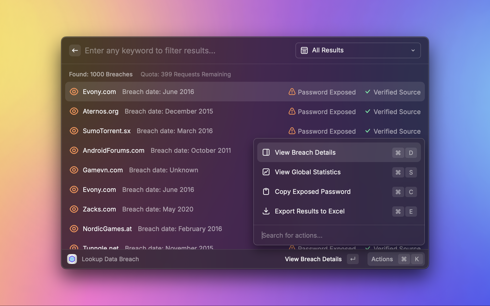
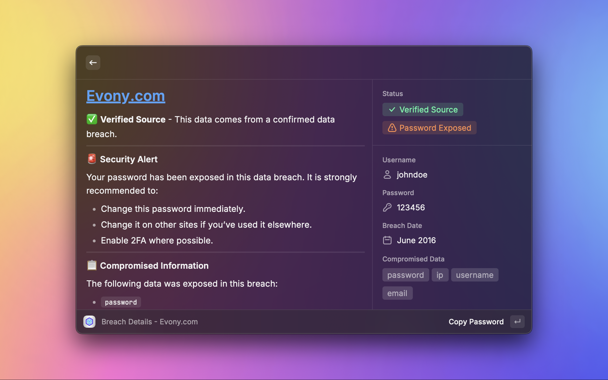
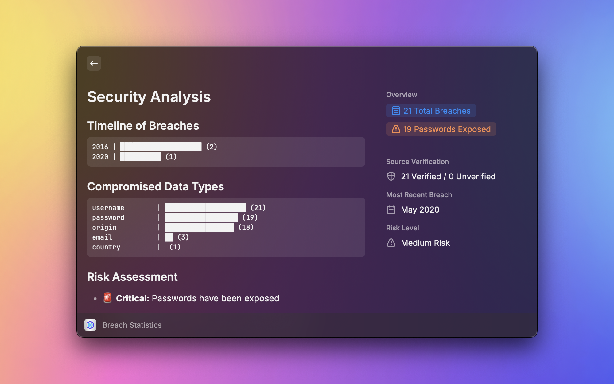

<div align="center">
  
  <h1>Leakcheck for Raycast</h1>
  <p>Search and monitor data breaches with ease</p>

  [](LICENSE)
  
  
</div>

## 📖 Table of Contents

- [About](#-about)
- [Features](#-features)
- [Screenshots](#-screenshots)
- [Installation](#-installation)
- [Configuration](#-configuration)
- [Usage](#-usage)
- [Privacy & Security](#-privacy--security)
- [Development](#-development)
- [License](#-license)

## 🚀 About

Leakcheck is a Raycast extension that allows you to search and monitor data breaches through the [Leakcheck API](https://leakcheck.io/). It provides an intuitive interface to check if your credentials have been compromised in data breaches.

## ✨ Features

- **🔍 Breach Search**: Search for breaches by email or username
- **🔔 Real-time Monitoring**: Continuous monitoring via menu bar (every 3h)
- **📊 Detailed Analytics**: Statistics and breach visualizations
- **🔐 Password Detection**: Identification of exposed passwords
- **📱 Native Interface**: Seamless integration with Raycast
- **⚡️ Performance**: Instant results and caching

## 📸 Screenshots

<div align="center">
  
  
  
</div>

## 📥 Installation

1. Make sure you have [Raycast](https://www.raycast.com) installed
2. Open Raycast Store and search for "Leakcheck"
3. Install the extension

## ⚙️ Configuration

1. Get an API key from [leakcheck.io](https://leakcheck.io)
2. In Raycast, open Leakcheck preferences
3. Add your API key

## 📖 Usage

### Available Commands

- `Lookup Data Breach`: Search for data breaches by email or username
- `Menu Bar Monitor`: Menu bar command to monitor your email for potential breaches


## 🔒 Privacy & Security

- API keys are stored securely
- No data is collected locally
- Requests are encrypted via HTTPS
- Monitoring is only performed on the configured email

## 🛠 Development

```bash
# Installation
git clone https://github.com/ahmosys/leakcheck-raycast
cd leakcheck-raycast
npm install

# Development
npm run dev

# Build
npm run build

# Linting
npm run lint
npm run fix-lint
```

## 📄 License

This project is licensed under the MIT License - see the [LICENSE](LICENSE) file for details.

---

<div align="center">
  Developed with ❤️ by <a href="https://github.com/ahmosys">Ahmosys</a>
  <br>
  Powered by <a href="https://www.raycast.com">Raycast</a> & <a href="https://leakcheck.io">Leakcheck</a>
</div>
